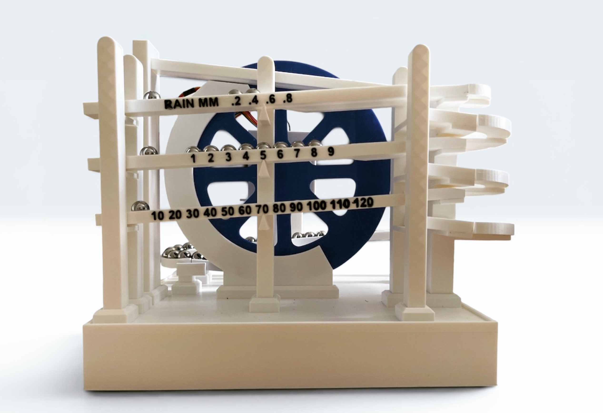

# Rain_Gauge_Ball_Clock

This page contains the Arduino code (running on a NodeMCU) for the rain gauge version of the ball clock. 

3D files are available on [Printables](https://www.printables.com/model/1738625-rain-gauge-ball-version).
